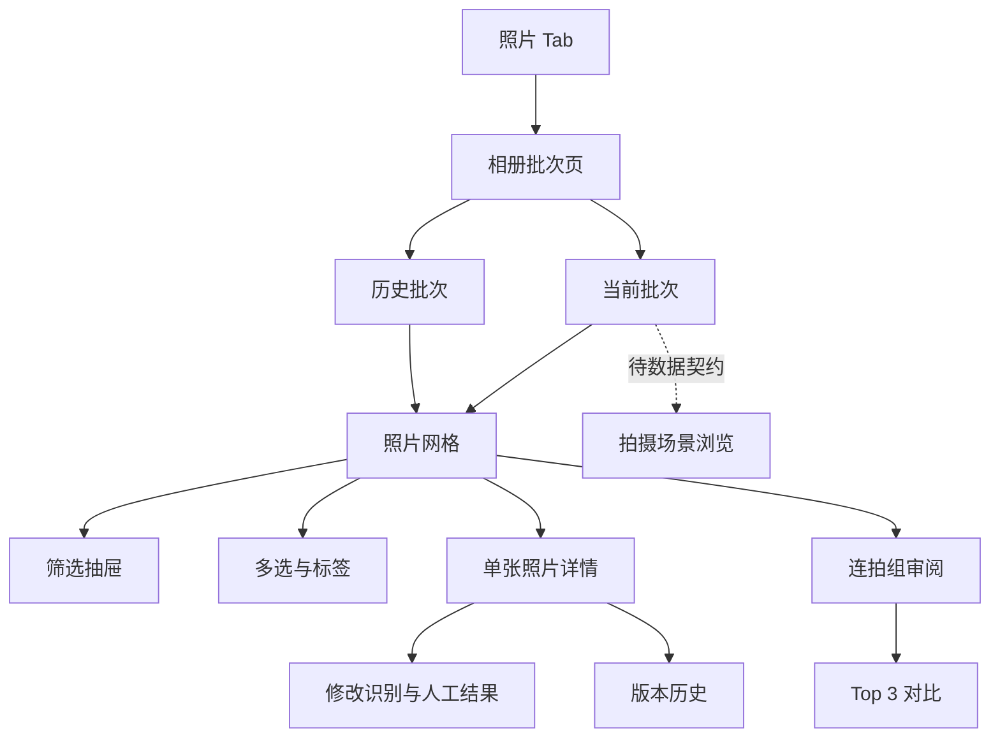

# 拍鸟伴侣「设备照片」UI 重构实施说明书

版本：1.0  
编制日期：2026-07-18  
设计稿目录：`C:\Users\32714\Desktop\拍鸟伴侣_UI设计图\照片`  
项目目录：`D:\Androidstudio2\project1\aves`

## 1. 结论先行

这组设计稿可以在不改动现有路由、状态管理和数据层职责的前提下，完成相册首页、批次列表、照片网格、筛选、多选、连拍审阅、照片详情和双图对比的大部分高保真重构。

但以下内容目前不能只靠 UI 安全落地：

1. **拍摄场景浏览**：当前模型只有 `groupId` 和连拍组，没有 `sceneId`、场景标题、场景封面、场景照片数等字段，也没有场景接口。
2. **断线状态相册的完整离线浏览**：当前只缓存已加载过的网络图片，并支持把修改操作加入待同步队列；批次、照片列表和照片详情没有持久化快照，不能保证断线后仍能重新进入并完整浏览。
3. **识别结果候选搜索**：现有修改页中的“白鹭 / 中白鹭 / 夜鹭”是界面内写死的演示候选，不能作为正式数据。需要鸟种词典或搜索接口；在接口补齐前只能显示盒子返回的候选，并提供自由文本人工修改。
4. **清晰度筛选、鸟眼单项评分**：模型有综合评分、画质评分、构图评分和原因标签，但没有独立清晰度等级、鸟眼评分字段，不能把原因标签冒充结构化指标。
5. **素材来源**：正式相册必须展示设备产生的真实缩略图/预览图，不应把网上鸟图作为业务数据。网上或生成素材只可用于空状态插画、背景纹样、Golden 测试夹具，并需确认授权。

实施原则是：**视觉可以高保真，数据必须真实，缺失能力必须降级或后置，不能用假交互掩盖接口缺口。**

## 2. 设计稿清单

设计稿共 10 张，均为 `852 × 1846 px`，约等于 430 × 932 逻辑像素的 1.98 倍导出图。

| 编号 | 设计稿 | 目标功能 |
|---|---|---|
| P01 | `照片首页.png` | 相册入口、设备状态、快速筛选、当前批次照片网格 |
| P02 | `当前批次与历史批次.png` | 当前/历史批次切换、批次统计与继续审阅 |
| P03 | `拍摄场景浏览.png` | 批次下按拍摄场景浏览 |
| P04 | `断线状态相册.png` | 断线提醒、缓存范围说明、离线浏览 |
| P05 | `连拍组审阅.png` | AI 推荐、组内横向选片、保留/弃用/精选 |
| P06 | `照片多选与标签抽屉.png` | 多选、批量状态与标签操作 |
| P07 | `照片筛选底部抽屉.png` | 评分、状态、清晰度、识别状态与排序 |
| P08 | `照片模块直接子页面（二级）\单张照片详情.png` | 单图预览、AI 信息、人工状态、详情展开 |
| P09 | `照片深层操作（二级）\两张照片对比.png` | 双图/多图对比、同步缩放、择优 |
| P10 | `照片深层操作（二级）\修改识别结果.png` | 修改鸟种、人工标签和保存 |

## 3. 当前项目能力基线

### 3.1 已有并可保留的业务能力

| 能力 | 当前实现 | 重构策略 |
|---|---|---|
| 当前/历史批次 | `BatchListPage`、`BatchListCubit` | 保留 Cubit 和仓储，重排视觉结构 |
| 批次分页与恢复 | `BatchRepository.page/current/resume` | 原样保留 |
| 照片分页 | `GalleryCubit` + 游标分页 | 原样保留 |
| 搜索 | 文件名、鸟种、标签统一搜索 | 换成设计稿样式，行为不变 |
| 快速筛选 | 全部、待复核、AI 推荐、精选、保留、弃用 | 文案统一为“待确认”；保留查询映射 |
| 高级筛选 | 鸟种、最低评分、置信度、标签、保留状态、分析状态 | 重新组织为设计稿抽屉；仅展示真实可查询项 |
| 排序 | 拍摄时间、评分、置信度 | 并入筛选抽屉或保留独立入口 |
| 多选 | 长按进入、多张切换 | 保留 `SelectionCubit` |
| 批量操作 | 弃用、待确认、保留、精选、添加/删除标签、撤销 | 高度贴合设计稿，接口已具备 |
| 连拍组 | 组列表、排序成员、推荐图、推荐原因 | 保留 `BirdGroup` 和 `GroupReviewCubit` |
| Top 3 对比 | 最多加载 4 张、同步/独立缩放、标记状态 | 重构布局，保留行为 |
| 单图详情 | 预览、主体框、识别、评分、EXIF、状态、版本历史 | 重构信息层级，保留仓储与冲突处理 |
| 人工修改 | 鸟种、评分、标签、保留状态 | 保留 `UserDecision` 保存契约 |
| 离线修改 | 单图和批量操作加入本地待同步队列 | 保留并明确提示“修改已排队” |
| 版本冲突 | 409 冲突、本地/盒子版本选择、撤销 | 不能因视觉简化而删除 |

### 3.2 当前关键代码入口

- 相册/批次入口：`lib/bird_companion/features/batches/presentation/batch_list_page.dart`
- 当前批次卡：`lib/bird_companion/features/batches/presentation/widgets/current_batch_card.dart`
- 历史批次项：`lib/bird_companion/features/batches/presentation/widgets/batch_list_tile.dart`
- 照片网格：`lib/bird_companion/features/gallery/presentation/gallery_page.dart`
- 查询模型：`lib/bird_companion/features/gallery/domain/photo_query.dart`
- 照片卡片：`lib/bird_companion/features/gallery/presentation/widgets/photo_tile.dart`
- 筛选与排序：`filter_sheet.dart`、`sort_sheet.dart`
- 多选操作栏：`selection_action_bar.dart`
- 连拍审阅：`lib/bird_companion/features/review/presentation/group_review_page.dart`
- 双图对比：`comparison_review_page.dart`、`widgets/comparison_photo_pane.dart`
- 单图详情：`photo_detail_page.dart`
- 修改结果：`review_edit_page.dart`
- 照片/审阅数据契约：`photo_models.dart`、`review_models.dart`
- 设备状态胶囊：`features/device/presentation/widgets/device_status_pills.dart`
- 统一组件：`app/theme/bird_ui.dart`

## 4. 设计稿到现有页面的对应关系

| 设计稿 | 当前页面/组件 | 对应程度 | 处理结论 |
|---|---|---:|---|
| 照片首页 | `BatchListPage` + `GalleryPage` | 70% | 将“相册首页”和“进入批次后的图库”分别实现；不强行合并 Cubit |
| 当前批次与历史批次 | `BatchListPage` | 90% | 可直接重构 |
| 拍摄场景浏览 | 无独立页面；`BirdGroup.type` 默认可能为 scene | 25% | 等待明确场景契约；不能仅根据 `type` 猜测完整场景数据 |
| 断线状态相册 | 全局 `DisconnectedBanner` + 图片磁盘缓存 + 待同步队列 | 45% | 第一阶段只显示真实缓存能力；完整离线浏览另立数据批次 |
| 连拍组审阅 | `GroupReviewPage` | 90% | 可直接重构，移除写死的推荐原因兜底文案 |
| 多选与标签抽屉 | `SelectionActionBar` + 标签对话框 | 90% | 可直接重构为底部抽屉/浮层 |
| 筛选底部抽屉 | `FilterSheet` + `SortSheet` | 75% | 合并视觉；隐藏无字段支持的清晰度项 |
| 单张照片详情 | `PhotoDetailPage` | 90% | 可直接重构，冲突、撤销和版本历史必须保留 |
| 两张照片对比 | `ComparisonReviewPage` | 90% | 可直接重构；保留同步/独立缩放 |
| 修改识别结果 | `ReviewEditPage` | 65% | 先移除写死候选；接口补齐后做正式鸟种搜索 |

## 5. 信息架构与导航决策

设计稿要求底部只有“相册 / 任务 / 我的”三个入口，但当前交付项目是“设备 / 照片 / 审阅 / 任务 / 我的”五入口。这是全局信息架构调整，不应夹在“照片 UI 重构”中顺手修改，否则会影响路由可达性、测试和已交付功能。

本轮建议：

1. 保持现有五入口及索引不变。
2. “照片”入口继续进入 `BatchListPage(openMode: gallery)`。
3. “审阅”入口继续进入 `BatchListPage(openMode: review)`。
4. 在照片页中复刻设计稿的相册标题、设备状态胶囊、批次卡、筛选和照片内容。
5. 若后续确定采用三入口，应单独启动“主导航 IA 重构”，把设备能力收进状态胶囊，把审阅能力收进相册内部，并对深链、返回栈、任务跳转和测试全面验收。

推荐页面流：



## 6. 视觉复刻规格

以下尺寸按 430 × 932 设计基准从截图推断，开发时使用逻辑像素 `dp`，不能直接使用 852 × 1846 的导出像素。

### 6.1 全局规格

| 项目 | 建议值 | 已有定义/建议 |
|---|---:|---|
| 页面背景 | `#F7F3EA` | `AppColors.paper` |
| 卡片背景 | `#FFFDF8` | `AppColors.paperStrong` |
| 主色 | `#245E2B` | `AppColors.brand` |
| 深色文字 | `#14341E` | `AppColors.ink` / `brandDark` |
| 次级文字 | `#706D68` | `AppColors.inkMuted` |
| 边框 | `#D8DDCF` | `AppColors.outline` |
| 保留 | `#3F7A35` | `AppColors.keep` |
| 待确认 | `#DE8B2D` | `AppColors.pending` |
| 弃用 | 灰或柔和砖红 | 删除型动作使用 `danger`，状态展示使用 `discard` |
| 精选 | `#D8A83C` | `AppColors.featured` |
| 页面左右边距 | 20–24 | 相册主页面优先 20；网格可缩到 12 |
| 卡片圆角 | 18–22 | 主卡 20；照片卡 12–14 |
| 抽屉顶部圆角 | 24–28 | 建议 28 |
| 主按钮高度 | 56–60 | 不小于 52 |
| 最小点击区域 | 48 × 48 | 图标按钮也必须满足 |
| 页面标题 | 26–28 / Semibold | 统一走 ThemeData |
| 卡片标题 | 18–21 / Semibold | 统一走 ThemeData |
| 正文 | 15–17 | 统一走 ThemeData |
| 辅助文字 | 12–14 | 颜色 `inkMuted` |
| 卡片间距 | 12–16 | 大区块间距 24 |
| 网格间距 | 6–8 | 三列网格 |
| 阴影 | 低透明度、Y=3–6、Blur=12–20 | 复用 `AppShadows.cardFor` |

### 6.2 响应式规则

1. 页面必须使用 `SafeArea`、`MediaQuery.padding` 或 Scaffold 自带安全区，不写死状态栏高度。
2. `< 360dp` 宽度时：批次统计允许收紧字号或换行；操作按钮保持至少 48dp，不强行四等分导致不可读。
3. `360–599dp`：照片网格三列。
4. `>= 600dp`：通过最小卡片宽度计算列数，建议 4–6 列；内容区最大宽度建议 760–900dp 居中。
5. 横屏和大字体下，底部抽屉使用可滚动 `DraggableScrollableSheet` 或 `ListView`，避免按钮被键盘/安全区遮挡。
6. 图片比例优先使用 API 的 `width/height`；网格可统一 1:1 裁切，详情页必须保留完整预览或允许缩放。
7. `textScaleFactor` 至少验证 1.0、1.3、1.6，状态标签不得截断核心含义。

## 7. 分页面实施说明

### 7.1 相册/批次首页（P01、P02）

目标文件：`batch_list_page.dart`、`current_batch_card.dart`、`batch_list_tile.dart`。

布局顺序：

1. 标题“相册”与右上角“＋”。
2. 设备状态胶囊：已连接、电量、可用存储；点击展开现有设备状态抽屉。
3. 当前/历史分段选择。
4. 当前批次卡：名称、日期、总数、已分析、待复核、保留、分析进度、进入批次。
5. 历史页：筛选栏、批次卡、恢复批次或查看图库。

行为要求：

- “＋”继续使用 `ConnectionArgs(entryMode: addOrSwitch)`，不能覆盖当前会话。
- 点击状态胶囊继续打开 `DeviceStatusSheet`。
- 当前/历史切换只改变显示，不重复创建仓储。
- 当前批次数据全部来自 `BatchSummary`；设计稿中的 3,672、1,284 等只是样稿，禁止写入代码。
- `reviewCount` 暂按现有页面语义显示为“待复核”，后端需确认其定义是待复核数量而非已复核数量。
- 设计稿的批次封面图当前没有字段，首期用统一的非照片装饰占位或首张真实缩略图（需接口明确）。“网上鸟图”不能伪装为该批次封面。

### 7.2 批次照片网格（P01）

目标文件：`gallery_page.dart`、`photo_tile.dart`。

布局：

1. 顶栏：返回、批次名称、照片总数、搜索、筛选、更多。
2. 快速筛选：全部、待确认、保留、弃用、精选；“AI 推荐”可作为额外项保留。
3. 激活筛选摘要与清除入口。
4. 三列缩略图；角标只呈现真实状态、评分或分析异常。
5. 下拉刷新、触底分页、空状态、错误状态。

关键约束：

- 当前标题显示的是 `batchId`。为了复刻设计稿中的批次名称，路由参数可扩展为包含 `batchId + batchName` 的可选字段，但必须兼容现有 `GalleryArgs(batchId)` 公共接口；或由现有批次页只负责显示名称而图库继续显示 ID。不得为了标题再隐式请求一个不存在的接口。
- 网格显示总数应优先使用批次的 `totalFiles`；当前 `GalleryState.items.length` 只是“已分页加载数量”，不能标成总照片数。
- `PhotoTile` 的 AI 推荐阈值当前写为评分 `>= 4.2`，需由产品/算法确认；未确认前只能保留现有行为，不能声称等同设计稿算法。
- 图片失败、分析中、低置信度、分析失败必须有明确占位；不能显示虚构鸟图。

### 7.3 断线状态（P04）

现阶段真实能力分级：

| 能力 | 当前是否支持 | UI 文案 |
|---|---:|---|
| 显示全局断线状态 | 是 | “设备连接已断开” |
| 重新连接 | 是 | “重新连接” |
| 已经成功缓存的缩略图继续显示 | 部分 | “部分已浏览图片可能可用” |
| 离线修改并稍后同步 | 是 | “修改已保存在本机，连接后同步” |
| 断线后重新加载批次列表 | 否 | 不应承诺 |
| 断线后重新加载照片分页/详情 | 否 | 显示不可用与返回入口 |
| 明确缓存批次、照片数、最后更新时间 | 否 | 待本地快照实现后再显示 |

第一阶段做法：

- 保留 Shell 的 `DisconnectedBanner`，图库内部增加不遮挡内容的离线说明卡。
- 如果当前列表仍在内存中，允许继续查看当前列表和已缓存图片。
- 对保存动作明确展示“已加入待同步队列”。
- 不显示“已缓存全部照片”“离线可完整浏览”等未经实现的承诺。

完整离线浏览批次需新增：批次快照、照片分页快照、详情快照、缓存版本和过期策略、设备维度隔离、缓存容量/清理策略。这属于数据层能力扩展，应另行评审，不包含在纯 UI 批次。

### 7.4 筛选抽屉（P07）

立即可落地项：

- 保留状态：待确认、保留、弃用、精选 → `keepState`。
- 最低综合评分 → `minScore`。
- 最低识别置信度 → `minConfidence`。
- 分析状态：已完成、分析中、低置信度、失败 → `analysisState`。
- 鸟种 → `species`。
- 标签 → `tags`。
- 排序：拍摄时间、评分、置信度 → `sort`。

后置项：

- 清晰 / 轻微模糊 / 模糊：没有结构化字段，不展示。
- 已识别 / 未识别：需确认 API 对 `analysisState` 与“无候选”的查询语义，不能只在客户端对当前分页过滤。
- AI 推荐优先：当前可映射 `score_desc`，但名称应写“评分优先”，除非后端确认推荐排序。

交互规则：

- 使用可滚动底部抽屉，顶部有拖拽条、标题、重置。
- “应用筛选”固定在安全区上方；键盘弹起时不遮挡。
- 关闭抽屉不应用；点击应用后重置游标并刷新。
- 当前 `PhotoQuery` 必须完整复制，不能因为修改某一项丢失搜索、分组或排序。
- 激活条件在网格上方以可删除标签展示。

### 7.5 多选与标签（P06）

目标文件：`selection_action_bar.dart`、`gallery_page.dart`。

- 长按首张进入多选；之后单击切换选中状态。
- 顶部显示“已选择 N 张”、取消和可选的全选当前已加载项。
- 底部操作：弃用、待确认、保留、精选、加标签、删标签。
- 设计稿中的“移动”“导出”等当前仓储没有操作契约，不能展示可点击假入口。
- 操作中禁用重复提交；部分失败要显示成功数与失败数。
- 在线成功保留现有撤销；离线排队不提供即时撤销，除非待同步队列支持删除指定操作。
- 标签输入沿用真实 API 的字符串列表，不写死样例标签为业务值。

### 7.6 连拍组审阅（P05）

目标文件：`group_review_page.dart`、`group_review_cubit.dart`。

可直接复刻：

- 组序号与张数。
- AI 推荐 Top 1 大图。
- 组内按 `rankOrder` 横向排列。
- 综合评分与 `recommendationReasons`。
- 当前照片的弃用、待确认、保留、精选。
- Top 3 对比、上一组、下一组。

必须修正：

- 当前当 `recommendationReasons` 为空时会写死“鸟眼清晰、主体完整、姿态自然”。正式版本应显示“暂无推荐说明”，不能伪造算法结果。
- Top 1 应由 `rankOrder.first` 或 `representativeFileId` 决定；没有排名时不显示“Top 1”承诺。
- 组级批量状态与单张状态要区分。当前页面按钮调用 `markFile`，只修改当前照片；如设计要“一键保留整组”，必须单独标明并调用 `markGroup`。
- 组内照片详情入口应保留，便于查看识别、EXIF 和人工结果。

### 7.7 双图/Top 3 对比（P09）

目标文件：`comparison_review_page.dart`、`comparison_photo_pane.dart`。

- 手机竖屏下两张照片优先并排；三张时允许横向滚动，不把每张压缩到不可审片。
- 保留同步缩放/独立缩放切换和重置。
- 每张仅展示真实的综合、画质、构图评分和原因标签。
- “鸟眼评分”没有字段时隐藏，不从原因标签推断数字。
- 提供保留左图/右图、精选或当前照片标记；保存中单项锁定。
- `Top 1` 只能依据 `rankOrder`，不能依据列表加载顺序猜测。

验收时重点检查：同一 `TransformationController` 驱动多个预览时的缩放同步、重建、切换独立模式和内存释放。

### 7.8 单张照片详情（P08）

目标文件：`photo_detail_page.dart` 及 `widgets/recognition_panel.dart`、`rating_reason_panel.dart`、`exif_panel.dart`、`subject_overlay_view.dart`。

信息层级：

1. 顶栏：返回、文件名或照片序号、撤销。
2. 可缩放预览和可选主体框。
3. AI 识别：候选、置信度、低置信度提醒。
4. 评分：综合、画质、构图、原因标签。
5. AI 建议：仅按已确认规则生成；当前 4.2 阈值需确认。
6. 人工动作：弃用、待确认、保留、精选。
7. 修改鸟种、评分、标签。
8. 可折叠 EXIF 与版本历史。

不能删除的非视觉功能：

- 409 冲突选择。
- 最近一次修改撤销。
- 版本号透传。
- 离线保存队列及提示。
- “使用盒子版本 / 保留本地版本”的分支。

设计稿顶部的“1 / N”需要图库上下文。现有路由只传 `fileId`，首期可显示文件名；若要支持序号与左右滑动，需兼容性扩展 `PhotoDetailArgs`，增加可选 `fileIds`、`initialIndex`、`batchId`，旧调用方式继续可用。

### 7.9 修改识别结果（P10）

目标文件：`review_edit_page.dart`。

第一阶段：

- 页面改为暖米白浅色体系，与设计稿一致。
- 显示盒子真实返回的识别候选及置信度。
- 允许人工输入鸟种、评分和标签。
- 保存仍返回 `ReviewEditResult`，不改变公开接口。
- 删除界面内写死的“白鹭 / 中白鹭 / 夜鹭”候选。

第二阶段（需要数据契约）：

- 鸟种本地词典或 `/species/search` 接口。
- 中文名、英文名、拉丁名与唯一 `speciesId`。
- 同名消歧、最近使用、无结果和自定义值策略。
- 目前 `UserDecision.userSpecies` 只有字符串；如果后端要求 ID，需要版本化扩展，不应由 UI 自行决定。

### 7.10 拍摄场景浏览（P03）

在数据契约补齐前不开发正式页面。至少需要：

```text
SceneSummary
- sceneId
- batchId
- title / displayName
- capturedFrom / capturedTo
- coverPreview
- photoCount
- burstGroupCount
- speciesSummary（可选）
- sortOrder
```

建议接口：

```text
GET /api/v1/projects/{batchId}/scenes
GET /api/v1/projects/{batchId}/scenes/{sceneId}/files
```

若后端确认 `BirdGroup.type == scene` 就是场景，应补充类型化模型与专用 Repository 方法，不能在页面中直接筛原始 Map。面包屑“批次 > 场景 > 连拍组”也必须使用真实 ID 驱动查询和返回栈。

## 8. 推荐复用与新增组件

### 8.1 直接复用

- `DeviceStatusPills`
- `DeviceStatusSheet`
- `BirdPageHeader`
- `BirdCard`
- `BirdButton`
- `BirdTag`
- `BirdBottomNavigation`
- `EmptyState`、`ErrorNotice`、`DisconnectedBanner`

### 8.2 建议提取

| 组件 | 用途 | 备注 |
|---|---|---|
| `AlbumBatchSegment` | 当前/历史切换 | 视觉组件，不持有仓储 |
| `AlbumQuickFilterBar` | 快速筛选 | 输入/输出 `PhotoQuery` |
| `PhotoStatusBadge` | 待确认、保留、弃用、精选、失败 | 统一颜色和语义 |
| `PhotoGridTile` | 网格缩略图 | 由现有 `PhotoTile` 演进 |
| `PhotoFilterSheet` | 高级筛选+排序 | 不直接访问 Repository |
| `PhotoSelectionSheet` | 多选操作 | 保留现有回调接口 |
| `ReviewDecisionBar` | 单图和连拍共用状态动作 | 输入 `KeepState` 与回调 |
| `RecognitionSummaryCard` | 候选与置信度 | 只展示真实模型数据 |
| `RatingSummaryCard` | 综合/画质/构图 | 字段为空时隐藏对应项 |
| `OfflineAlbumNotice` | 真实离线能力说明 | 不承诺未缓存内容 |
| `ReviewPhotoViewer` | 详情、连拍、对比共用图片查看 | 统一加载、错误、缩放和主体框策略 |

组件只负责布局与事件回调。分页、保存、冲突、同步和错误状态继续由现有 Cubit/Repository 管理。

## 9. 实施批次

### 批次 A：相册入口与批次页

范围：P01 的页头与设备状态、P02 当前/历史批次。

- 重构 `BatchListPage`、`CurrentBatchCard`、`BatchListTile`。
- 复用设备状态胶囊和新增设备入口。
- 不改路由、不改 BatchRepository。
- 补当前/历史、空态、错误态、窄屏 Widget 测试。

验收门槛：批次打开、恢复、设备状态抽屉和新增/切换设备均可达。

### 批次 B：图库、筛选与断线真实态

范围：P01 照片网格、P04、P07。

- 重构 Gallery 页头、快速筛选、PhotoTile。
- 将筛选和排序整合为设计稿抽屉。
- 加入真实能力范围内的离线说明。
- 保留分页、搜索、刷新、筛选恢复。

验收门槛：任意筛选组合不丢字段；断线不崩溃、不虚假承诺；分页总数与已加载数文案不混淆。

### 批次 C：多选和标签

范围：P06。

- 重构选中态和底部操作抽屉。
- 保留批量结果、部分失败、撤销、离线排队。
- 不增加移动/导出假入口。

验收门槛：长按、增减选择、取消、六种现有操作、重复提交保护全部通过。

### 批次 D：连拍审阅与对比

范围：P05、P09。

- 重构推荐大图、缩略图带、决策栏、组导航。
- 重构双图/Top 3 布局和同步缩放。
- 移除虚构推荐原因。

验收门槛：成员排序、Top 1 来源、单张/整组操作语义、上一组/下一组、对比保存均正确。

### 批次 E：单图详情与识别修改

范围：P08、P10。

- 重构详情信息层级和底部决策。
- 修改页接入真实候选，删除写死候选。
- 保留冲突、历史、撤销、离线排队。

验收门槛：在线保存、离线保存、409 冲突、本地/盒子选择、撤销和版本历史均通过。

### 批次 F：场景浏览与完整离线能力

前置条件：场景接口与本地快照契约评审通过。

- 增加 scene domain/repository/cubit/page。
- 增加设备维度的批次/照片/详情快照。
- 明确缓存容量、过期、清理、重新连接一致性。

验收门槛：断线冷启动仍能进入已缓存批次；场景数量、照片数量和面包屑全部由真实数据驱动。

### 批次 G：Pixel Perfect 与回归验收

- 430 × 932 基准截图比对。
- 360 × 800、390 × 844、430 × 932、平板宽度测试。
- 浅色、深色（无设计稿时至少保证可用）、字体缩放 1.0/1.3/1.6。
- 真实设备照片、空数据、超长批次名、超长鸟种名、无评分、无候选、图片失败。
- 在线、断线、重连、部分失败、冲突。

每个实施批次完成后运行：

```powershell
dart format lib test
flutter analyze
flutter test
```

## 10. 验收清单

### 功能连接

- [ ] 照片 Tab → 当前/历史批次可达。
- [ ] 批次 → 图库可达，返回后仍保持批次页状态。
- [ ] 图库 → 单图详情可达，返回后筛选和滚动位置尽量保持。
- [ ] 图库 → 连拍审阅 → Top 3 对比可达。
- [ ] 单图详情 → 修改结果 → 保存/冲突/撤销闭环完整。
- [ ] 设备状态胶囊 → 状态详情、重连、任务跳转正确。
- [ ] 断线操作 → 待同步队列 → 重连刷新闭环正确。

### 数据真实性

- [ ] 无设计稿示例数字写入业务代码。
- [ ] 无网上鸟图作为真实批次或照片内容。
- [ ] 无写死鸟种候选。
- [ ] 无写死 AI 推荐原因。
- [ ] 无从原因标签伪造鸟眼/清晰度数字。
- [ ] 已加载数量不冒充总数量。
- [ ] 无“完整离线可用”等未实现承诺。

### 视觉和可用性

- [ ] 430 × 932 下与设计稿层级、比例、颜色和圆角一致。
- [ ] 触控区域不小于 48dp。
- [ ] 底部抽屉避开系统安全区和键盘。
- [ ] 超长文案不溢出，重要状态不被截断。
- [ ] 图片加载中、失败、无预览都有一致占位。
- [ ] 选中、禁用、提交中、成功、失败状态可辨识。
- [ ] TalkBack 标签、按钮 tooltip 和语义正确。

## 11. 仍需确认的产品与接口问题

开始对应批次前，按优先级确认：

1. `reviewCount` 的准确含义是否就是“待确认/待复核数量”。
2. AI 推荐阈值是否固定为综合评分 4.2，还是由后端直接给推荐标记。
3. `group.type` 的枚举和 `scene` 是否已有正式语义。
4. 场景是否需要独立实体与接口。
5. 批次封面来自首张照片、推荐照片还是后端字段。
6. 鸟种搜索使用本地词典还是盒子接口；是否需要 speciesId。
7. 清晰度与鸟眼评分的正式字段和量纲。
8. 离线浏览要求是“当前内存继续看”还是“断线冷启动也能看”。
9. 是否正式把五入口改为三入口；若改，需独立 IA 重构。
10. 设计稿中的示例照片是否有可商用授权；若无，只用于视觉参考。

## 12. 建议的下一步

优先按 **批次 A → B → C → D → E** 实施，这五批都能最大限度复用现有功能并快速获得高保真结果。批次 F 必须等待场景与离线数据契约，不能和 UI 同时猜测开发。

第一轮实际改造建议从“相册入口与批次页”开始，因为它已具备完整数据和设备状态组件，风险最低，同时能确立后续照片模块共同使用的页头、卡片、状态标签和响应式基线。
