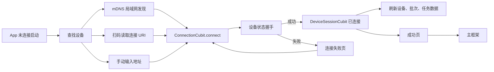

# 拍鸟伴侣：设备连接 UI 重构复核与补漏执行说明书

> 项目：`D:\Androidstudio2\project1\aves`  
> 设计稿：`C:\Users\32714\Desktop\拍鸟伴侣_UI设计图\设备连接`  
> 复核范围：设备发现、扫码、手动地址、连接过程、失败、成功、设备状态抽屉，以及它们与相册、任务、我的、设备会话之间的衔接。  
> 本文用途：作为下一轮补漏、开发、自测、真机验收和产品确认的执行依据；本文不授权修改数据层协议或整体导航信息架构。

## 1. 复核结论

本阶段已经完成设备连接模块的主体 UI，并且没有破坏现有的 Repository、API、会话和路由接口。当前主链路可以表达为：

整体判断：**主连接能力已经可用，但页面入口、返回结果和跨板块导航仍有关键缺口，暂不建议直接以“设备连接 UI 全部验收通过”结束该阶段。**

建议先完成第 5 节的批次 E，再进行真实 Android 设备验收；整体导航由五入口改成三入口应作为独立产品决策，不与本轮补漏混改。

## 2. 已确认正确的实现

| 项目 | 当前结果 | 复核结论 |
|---|---|---|
| 设备发现 | 使用 `_birdbox._tcp.local` 的 mDNS 发现，并保留最近设备 | 与当前项目真实能力一致 |
| 发现与最近设备分区 | `ConnectionCubit` 将最近设备从新发现列表中排除 | 语义清晰，避免重复展示 |
| 手动地址 | 支持 IP、主机名、HTTP/HTTPS 地址 | 保留原有功能 |
| 二维码格式 | 支持 HTTP、HTTPS 和 `birdbox://` 连接 URI | 没有虚构设备码协议 |
| 连接进度 | 使用不确定进度，不显示虚构百分比 | 正确处理后端没有进度事件的问题 |
| 迟到请求结果 | 返回查找设备后会忽略迟到的连接成功结果 | 已有生命周期测试覆盖 |
| 失败重试 | 重试最后一次连接，而不是误执行普通刷新 | 已有 Cubit 测试覆盖 |
| 成功信息 | 电量、存储和 SD 卡来自真实 `DeviceStatus` | 未使用设计稿演示数据冒充真实状态 |
| 绑定文案 | 仅在 `isPaired == true` 时显示“已绑定” | 与真实字段一致 |
| 设备状态 | 温度、容量、SD 卡、任务、异常来自 `DeviceStatus` | 数据来源正确 |
| 状态和任务解耦 | 连接成功通过 `DeviceSessionCubit` 触发全局刷新 | 与项目现有架构衔接正确 |
| 响应式基础 | 主要状态页可滚动，已覆盖 320/360/430dp 宽度 | 基础布局没有固定高度溢出 |

## 3. 设计稿逐页覆盖情况

| 设计稿 | 当前页面/状态 | 覆盖度 | 仍缺少的内容 |
|---|---|---:|---|
| `连接和发现可连接设备.png` | `ConnectionPage` 搜索和设备列表 | 85% | 设计稿蓝牙语义已按真实 LAN 功能修正；未提供已连接状态下的“＋新增设备”入口 |
| `查找设备-未发现.png` | `ConnectionEmptyView` | 85% | 背景和组件已复刻；排查步骤按 LAN 能力修正 |
| `扫码确认设备.png` | `QrConnectionScannerPage` | 60% | 当前扫到合法 URI 后立即发起连接，没有“已发现设备—用户确认连接”的中间状态 |
| `扫描失败.png` | 扫码页 `_InvalidCodeNotice` | 65% | 缺少三幅排查示意图；“手动输入地址”回传未闭环；重新扫描未重启扫描状态 |
| `正在连接.png` | `ConnectionProgressView` | 85% | 不显示虚假 65% 是正确调整；缺少真实步骤进度事件，因此只能展示语义步骤 |
| `连接失败.png` | `ConnectionFailureView` | 80% | 失败排查内容仍为通用 LAN 建议，尚未按错误类型动态变化 |
| `绑定并连接成功.png` | `ConnectionSuccessView` | 75% | 1.5 秒自动跳转与页面按钮冲突；从有上级页面进入时按钮目标不稳定 |
| `设备状态底部抽屉.png` | `DeviceStatusSheet` | 70% | 抽屉仅从设备页指标卡进入，尚未接到设计稿中的相册顶部状态胶囊 |

## 4. 缺漏与风险清单

### 4.1 S1：验收前必须处理

#### S1-1 扫码页“手动输入地址”没有形成闭环

- 现状：扫码页点击“手动输入地址”只执行 `Navigator.pop()`。
- 结果：父页面收到 `null` 后不做任何操作，用户回到查找页，但手动输入表单不会自动展开。
- 涉及代码：`QrConnectionScannerPage`、`ConnectionPage._scanAndConnect()`。
- 建议：为扫码页返回一个明确结果类型，例如 `QrConnectionResult.uri(uri)`、`QrConnectionResult.manual`、`QrConnectionResult.cancelled`；父页面收到 `manual` 后展开 `ManualAddressForm` 并滚动到可见位置。
- 接口约束：保留兼容旧 `Uri` 回传的适配层，或一次性更新所有本地调用点和测试。
- 验收：从扫码正常态、无效码状态、相机异常状态点击手动输入，都能返回并自动聚焦地址输入框。

#### S1-2 成功页自动跳转与按钮行为冲突

- 现状：进入成功状态 1.5 秒后自动 `_finishConnection(0)`；页面同时提供“进入相册”和“查看设备状态”。
- 风险：用户通常来不及阅读真实状态或点击按钮；成功页视觉价值基本丢失。
- 现状补充：`_finishConnection()` 在 `Navigator.canPop == true` 时只执行 `pop()`，忽略传入的目标 Tab。未来从相册“＋”进入连接页后，“进入相册”和“查看设备状态”可能产生相同结果。
- 建议：取消自动跳转，成功页由用户主动选择；如果必须自动跳转，至少延长至 3–5 秒并提供可见倒计时及暂停语义。
- 导航实现：优先通过 `BirdShellNavigation.selectTab()` 切换已有 Shell；不在 Shell 内时使用 `pushNamedAndRemoveUntil(BirdRoutes.shell, ...)` 并传递正确 `ShellArgs`。
- 验收：分别从首次启动、设置页、未来相册“＋”入口完成连接，两个按钮均到达其文字对应的目标页面，且不会留下重复 Shell。

#### S1-3 设备状态抽屉没有接入相册顶部状态入口

- 现状：`DeviceStatusSheet` 只能通过 `DeviceStatusPage` 的 `DeviceMetricsGrid` 打开。
- 设计要求：相册一级页面顶部显示“已连接 / 电量 / 存储”状态胶囊，点击后打开抽屉；右上角“＋”进入新增或切换设备。
- 当前问题：从设备详情页打开状态摘要再点击“查看设备详情”只会关闭抽屉，交互关系是循环的；已连接用户也没有直接新增/切换设备入口。
- 建议：先提取独立的 `DeviceStatusPills`，由相册或批次一级页订阅 `DeviceStatusCubit`/共享状态后展示；点击胶囊打开现有 Sheet；右上角“＋”打开 `/connection`。
- 边界：本次只增加入口，不同时把五个底部 Tab 改成三个。
- 验收：相册一级页可以直接查看状态、进入任务、重新连接和新增设备；从抽屉“查看设备详情”进入设备页。

#### S1-4 浅色设计稿与系统深色主题存在冲突

- 现状：App 跟随系统深色主题，但 `ConnectionBackground`、连接页 Scaffold 和多张卡片硬编码浅色背景。
- 风险：深色主题的浅色文字可能显示在米白背景上，形成低对比度或不可读内容。
- 建议二选一：
  1. 为连接模块补齐深色背景、卡片、纹样遮罩和状态色；或
  2. 产品确认连接模块始终使用浅色后，在该路由局部应用完整的 `AppTheme.light()`，包括文字、图标、Sheet 和 AppBar，而不是只硬编码背景。
- 验收：系统浅色和深色各跑一次全流程，正文、次要文字、禁用按钮和错误文字均清晰可读。

#### S1-5 当前 Golden 无法验证中文视觉

- 现状：`connection_empty_430x932.png` 中中文显示为方框。
- 影响：Golden 虽能检测布局变化，但不能检查中文字体、字重、行高、截断和真实宽度，因此不足以证明 Pixel Perfect。
- 建议：在测试初始化阶段加载项目确定的中文字体，或在专用截图测试中注册可再分发的 CJK 测试字体；重新生成全部视觉基线。
- 验收：Golden 中所有中文可读，并与真机使用的字体度量一致或明确记录差异。

### 4.2 S2：高优先级完善项

#### S2-1 缺少扫码后的确认状态

设计稿要求扫码后先显示设备名称、设备号后四位和发现方式，再由用户确认。当前二维码只提供 URI，设备身份要在握手后才能获得。

执行前需要确认后端能力：

- 若有只读预检接口：新增 `previewDevice(uri)`，读取设备身份但不写入最近设备或活动设备。
- 若没有预检接口：确认卡只能显示目标地址，不能伪造设备名和编号；也可保留“扫码后直接连接”的现状，并在产品文档中确认该差异。

#### S2-2 无效二维码的“重新扫描”只是清理提示

- 当前使用 `DetectionSpeed.noDuplicates`，`_retryScan()` 仅清理本地布尔值，没有重新启动 Controller 或重置去重状态。
- 建议：明确停止并重新启动扫描会话，或采用可验证的去重策略；增加“同一无效二维码移开后再次扫描”的真机用例。

#### S2-3 “本地连接地址”文案与 URI 校验不完全一致

- 当前 HTTP/HTTPS 解析只检查 scheme 和 host，公网域名也可以通过。
- 页面文案承诺二维码用于本地连接地址。
- 建议：产品与安全共同决定是否只允许私网 IP、`.local` 主机或受信域名。若继续允许任意主机，应调整文案并在连接前显示目标主机确认。
- 补充边界测试：非法端口、超范围端口、空 host、用户信息、IPv6、路径和重定向。

#### S2-4 状态摘要存在过度推断

- “已连接”在 Sheet 内为固定文案，没有读取实时 `DeviceSessionState`。
- 任意 `status.hasError` 都会让“存储”摘要显示“需要检查”，即使错误与存储无关。
- `temperature < 70` 被直接判断为“正常”，但接口没有提供设备正常阈值。
- 建议：连接状态由 `DeviceSessionCubit` 传入；存储告警只由容量或卡错误决定；没有正式阈值时只显示温度数字，或由设备接口返回健康状态。

#### S2-5 新增或切换设备的会话语义尚未定义

- 当前成功连接会直接替换活动设备。
- 当前取消连接会把全局 Session 标记为 disconnected；如果未来从已连接设备进入“新增设备”，取消新设备连接不应断开原设备。
- 建议：连接页增加 `ConnectionEntryMode.initialSetup / addOrSwitch`；切换成功前保留旧会话，成功后再原子替换。

#### S2-6 错误提示需要按真实错误分类

当前失败页标题使用 `UserMessageMapper`，但排查卡始终是相同三步。建议至少区分：

- 超时或网络不可达；
- 401/403 授权或配对问题；
- TLS/证书问题；
- 设备返回异常状态；
- 地址格式或 DNS 错误。

不得将原始堆栈、令牌或内部完整 URL 显示给用户。

### 4.3 S3：视觉和体验优化

- 扫码失败页缺少设计稿中的“避免反光 / 保持距离 / 确保清晰”图形化说明；当前只在帮助 Sheet 中以列表展示。
- 扫码页缺少设计稿“从相册识别”，但项目尚无可靠图片解析流程，因此暂不应加入无效按钮。
- 连接中页面标题、圆环与设备图的比例仍可继续按 430×932 设计稿微调。
- K7 PNG 为 1254×1254，运行时完整解码约占 6 MB；建议按显示尺寸提供 1x/2x 资源或使用 `cacheWidth`，同时验证清晰度。
- 湿地背景为 853×1844，适合设计稿约 2x 输出；仍需检查超长屏、横屏和折叠屏裁剪。
- 三列状态摘要在大字体模式下使用 `FittedBox` 缩小文字，不符合“中老年友好”的优先级；大字体时应改为两列或纵向布局。
- 为扫描框、状态摘要、错误状态和设备图片补齐语义标签、读屏顺序和按钮状态说明。

## 5. 后续实施批次

### 批次 E1：修复当前交互闭环

目标：不改数据协议，先修复用户可以直接遇到的问题。

1. 建立扫码结果类型，修复“手动输入地址”回传。
2. 修复无效码重新扫描状态。
3. 移除或调整成功页 1.5 秒自动跳转。
4. 把成功按钮导航封装成明确的 `ConnectionCompletionTarget.gallery/device`。
5. 新增扫码返回、成功页来源和导航栈 Widget 测试。

完成标准：首次启动、扫码、手动输入、失败重试和成功去向全部可由自动化测试证明。

### 批次 E2：接通相册、设备与任务

目标：补齐设计稿要求的跨板块入口，不改底部 Tab 数量。

1. 提取 `DeviceStatusPills`。
2. 在相册或照片批次一级页接入状态胶囊和“＋”。
3. 状态 Sheet 的“查看设备详情”切到 Tab 0。
4. “当前任务”切到 Tab 3，并在无 Shell 环境使用明确路由。
5. 定义 add/switch 模式下保留旧 Session 的行为。

完成标准：相册 → 状态抽屉 → 设备/任务，以及相册“＋” → 连接 → 返回目标页，形成完整闭环。

### 批次 E3：状态语义和主题修正

目标：避免 UI 展示超出真实数据含义的信息。

1. 状态 Sheet 接入实时 Session 状态。
2. 拆分设备异常、SD 卡异常和容量告警。
3. 删除未得到产品确认的温度“正常”阈值推断。
4. 决定连接模块深色方案或局部强制浅色方案。
5. 添加浅色、深色、200% 字体和 TalkBack 语义测试。

### 批次 E4：扫码确认与安全边界

目标：在后端能力明确后补齐“扫码确认设备”。

1. 确认是否存在无副作用的设备预检接口。
2. 确认允许的 URI 主机范围、HTTPS 和证书策略。
3. 根据结论实现确认卡或正式记录“扫码即连接”的产品差异。
4. 增加 URI 边界、安全和重定向测试。

### 批次 E5：视觉回归与真机验收

目标：证明页面不仅无溢出，而且接近设计稿并在真实硬件上可用。

1. 修复中文 Golden 字体。
2. 为 8 个设计状态分别生成 430×932 基线。
3. 增加 360×800、393×852、430×932 和 200% 字体布局测试。
4. Android 真机验证相机首次授权、永久拒绝、从系统设置返回、闪光灯、自动对焦。
5. 在家庭 Wi-Fi、手机热点、双频网络和网络切换场景验证 mDNS 与握手。
6. 验证连接成功后批次、任务、设备状态是否真正刷新。

## 6. 建议测试矩阵

| 场景 | 自动化 | 真机 | 预期 |
|---|---|---|---|
| 首次启动无设备 | Widget/Golden | 是 | 搜索后进入空状态，可扫码或手输 |
| 发现一台新设备 | Widget | 是 | 只显示在“可用设备” |
| 最近设备再次被发现 | Cubit | 是 | 不在两个分区重复显示 |
| 扫描合法二维码 | Widget/Parser | 是 | 进入确认或连接流程 |
| 扫描无效二维码 | Widget | 是 | 保持相机画面，错误可恢复 |
| 拒绝相机权限 | Widget 辅助 | 是 | 可打开设置，也可转手动输入 |
| 手动地址无效 | Widget | 否 | 阻止提交并显示字段错误 |
| 连接超时 | Cubit/Widget | 是 | 显示可执行的超时建议并可重试 |
| 连接时返回查找 | Cubit | 是 | 迟到结果不会切换会话 |
| 成功进入相册 | Navigation Widget | 是 | 到照片/批次入口，不重复创建 Shell |
| 成功查看设备 | Navigation Widget | 是 | 到设备 Tab，状态已刷新 |
| 相册点击状态胶囊 | Widget | 是 | 打开真实状态 Sheet |
| 状态 Sheet 打开任务 | Navigation Widget | 是 | 到任务中心或任务详情 |
| 系统深色模式 | Golden | 是 | 无低对比度和浅深主题混用 |
| 字体 200% | Widget | 是 | 不截断核心信息，操作仍可见 |
| 网络中途切换 | Cubit/Integration | 是 | 会话状态、横幅和重连提示一致 |

## 7. 整体导航信息架构的决策点

设计稿要求底部只有“相册 / 任务 / 我的”三个入口，当前项目为“设备 / 照片 / 审阅 / 任务 / 我的”五个入口。直接修改会影响：

- Shell 下标和全部 `ShellArgs`；
- 设备状态页入口；
- 批次浏览与智能审阅的区分；
- 任务跳转；
- 所有现有导航测试和用户使用习惯。

因此建议在本阶段保持五入口，只补齐相册状态胶囊和新增设备入口。待产品确认三入口信息架构后，另开“Shell 导航重构”阶段，统一迁移所有下标和路由，不在设备连接补漏中局部修改。

## 8. 验收输出要求

每个批次完成后必须汇报：

1. 修改文件和公开接口变化；
2. 对应的设计稿页面；
3. 保留、调整或未实现的业务语义；
4. 新增的 Widget/Cubit/导航测试；
5. `dart format`、`flutter analyze --no-pub` 和 `flutter test --no-pub` 结果；
6. Android 真机型号、系统版本、网络环境和权限状态；
7. 仍缺少的设备协议、文案或原始素材。

最终验收条件不是“页面长得相似”，而是：**八个设计状态有对应实现、所有操作有真实落点、连接后的数据能够刷新、返回路径不会破坏会话，并且在真实 Android 设备和目标屏幕尺寸上可稳定使用。**
