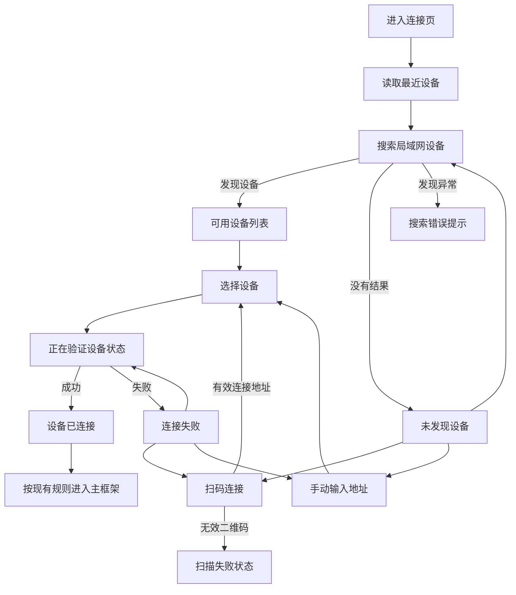

# 拍鸟伴侣：设备连接 UI 重构实施说明书

> 适用项目：`D:\Androidstudio2\project1\aves`  
> 设计稿目录：`C:\Users\32714\Desktop\拍鸟伴侣_UI设计图\设备连接`  
> 文档目标：在不破坏现有连接能力、状态管理和路由的前提下，尽量高保真复刻设备连接设计稿，并明确设计稿与真实功能之间的差异。

## 1. 实施结论

设备连接模块不能直接按截图逐张“照画”，应采用以下原则：

1. **视觉可以高保真，功能描述必须以现有代码为准。**
2. **继续使用现有 `ConnectionCubit`、`ConnectionRepository`、`DeviceSessionCubit` 和 `/connection` 路由。**
3. **第一轮只重构连接相关页面，不同时改相册、任务、设置等其他页面。**
4. **设计稿中的蓝牙发现、设备绑定和连接百分比，目前都没有完整业务实现，不能用静态文案伪装成真实能力。**
5. **设备图、湿地背景和说明插画需要原始资源；只有扁平截图时，只能先用占位资源或代码绘制近似背景。**

推荐采用“真实功能优先的高保真版本”：保留设计稿的布局、配色、卡片、按钮、背景和设备视觉，但把蓝牙、绑定、进度等文案调整为项目当前真实支持的语义。

## 2. 当前项目真实具备的连接能力

### 2.1 已实现能力

| 能力 | 当前实现 | 主要代码 |
|---|---|---|
| 加载最近设备 | 从本地缓存读取 `recent_devices` | `ConnectionRepositoryImpl.recentDevices()` |
| 局域网发现 | 使用 mDNS，服务名 `_birdbox._tcp.local`，默认超时 3 秒 | `MdnsDeviceDiscoverySource` |
| 手动地址连接 | 接受 IP、主机名或 HTTP/HTTPS 地址 | `ManualAddressForm` |
| 二维码连接 | 二维码必须包含可解析的连接 URI，或 `birdbox://` 格式的 host/port | `QrConnectionScannerPage` |
| 连接验证 | 请求设备 `/api/v1/device/status`，成功后保存设备并配置 API 地址 | `ConnectionApi.handshake()` |
| 最近设备缓存 | 最多保存 10 台设备，并记录当前活动设备 | `ConnectionRepositoryImpl.connect()` |
| 自动重连 | 网络恢复后，使用已缓存设备重新连接 | `DeviceSessionCubit.reconnect()` |
| 连接成功后刷新 | 请求业务模块刷新并同步离线操作 | `DeviceSessionCubit.connected()` |
| 设备状态 | 电量、温度、容量、SD 卡、当前任务、异常、版本 | `DeviceStatus`、`DeviceStatusCubit` |
| 扫码相机权限 | `bird` Android Manifest 已声明 `CAMERA` | `android/app/src/bird/AndroidManifest.xml` |

### 2.2 当前没有完整实现的能力

| 设计稿能力 | 当前情况 | 实施要求 |
|---|---|---|
| 蓝牙扫描设备 | 没有 BLE 扫描代码，也没有蓝牙运行时权限流程 | 第一版将文案改为“局域网发现”；如必须蓝牙，需要单独立项 |
| 显示蓝牙信号强度 | 模型有可选 `signalStrength`，但当前 mDNS 发现不会提供 | 无值时不显示信号格或 dBm |
| 正式设备绑定 | 存在 `isPaired` 字段和 `/device/pair` 路径，但连接流程没有调用配对接口 | 未确认接口前不得默认显示“已绑定” |
| 真实连接百分比 | `connect()` 是一次 Future，没有步骤进度回调 | 使用不确定进度，不显示虚假的 65% |
| 真正取消网络请求 | 当前没有 CancelToken 或仓储取消接口 | 第一版“取消”只能退出页面或忽略结果；严格取消需改数据层 |
| 从相册识别二维码 | 当前页面只使用实时相机扫描 | 需要验证 `mobile_scanner` 图片分析能力后再接入 |
| 设备帮助页 | 当前没有对应路由和产品内容 | 可以先做帮助底部 Sheet，但需要产品提供文案 |

## 3. 设计稿与 Flutter 页面对应关系

| 设计稿 | 建议对应状态 | 现有数据来源 | 实施方式 |
|---|---|---|---|
| `连接和发现可连接设备.png` | `loading` 或发现到设备后的 `initial` | `discoveredDevices` | 重构 `ConnectionPage` 的发现视图 |
| `查找设备-未发现.png` | 发现结束，`discoveredDevices.isEmpty` | mDNS 结果 | 新建无设备视图；最近设备应单独显示，不能冒充本次发现结果 |
| `扫码确认设备.png` | 扫描页正常状态 | `MobileScanner` | 重构 `QrConnectionScannerPage` |
| `扫描失败.png` | 扫到无效内容或无法解析 URI | `_parseConnectionUri()` 返回 null | 将当前 SnackBar 升级为页面内错误状态 |
| `正在连接.png` | `ConnectionPhase.connecting` | `ConnectionCubit.state.phase` | 新建连接中视图；采用不确定进度 |
| `连接失败.png` | `ConnectionPhase.failure` 且最后请求为连接 | `UserMessageMapper` | 新建全屏失败视图，复用 `retry()` |
| `绑定并连接成功.png` | `ConnectionPhase.connected` | `state.status` | 新建成功视图；是否停留需遵守既有导航策略 |
| `设备状态底部抽屉.png` | 已连接后的设备摘要 | `DeviceStatusCubit` | 独立组件，放到相册顶部状态胶囊之后实施 |

## 4. 必须先确定的产品语义

### 4.1 发现方式

当前项目实际是 **mDNS 局域网发现**，不是蓝牙发现。因此推荐将设计稿文案调整为：

- “正在搜索附近设备……” → “正在搜索同一网络下的设备……”
- “蓝牙信号良好” → “局域网可连接”
- “通过蓝牙发现” → “通过局域网发现”
- “打开蓝牙与必要权限” → “连接同一 Wi‑Fi，并允许本地网络访问”

如果产品确定必须使用蓝牙配对，必须先补齐 BLE 扫描协议、服务 UUID、Android 权限、设备广播数据和连接地址交换协议，再实施对应 UI。

### 4.2 绑定语义

连接成功不等于绑定成功。页面标题应按数据决定：

- `status.connection.isPaired == true`：可以显示“已绑定并完成连接”。
- `isPaired == false` 或接口未返回：只显示“设备已连接”。

不得因为连接成功就把 `isPaired` 写死为 true。

### 4.3 连接进度

设计稿中的 65% 没有真实数据来源。推荐视觉方案：

- 保留大圆环和设备主视觉。
- 圆环使用 `CircularProgressIndicator(value: null)` 或循环描边动画。
- 中央文案显示“正在连接中”。
- 下方步骤仅展示真实状态：
  1. 已确认连接地址；
  2. 正在验证设备状态；
  3. 连接完成后同步数据。
- 不显示具体百分比和“已完成/进行中”伪进度。

如果后端以后提供明确的握手步骤或进度事件，再将进度扩展到 `ConnectionState`。

### 4.4 成功页导航

当前代码连接成功后立即返回上一页，或替换为主框架。为了既保留行为又展示设计，可以采用：

- 连接成功后展示成功页 800–1200ms；
- 然后执行现有 `pop()` / `pushReplacementNamed(BirdRoutes.shell)`；
- 用户点击“进入相册”时立即完成跳转；
- “查看设备状态”只有在目标页面和 Tab 映射明确后再启用。

如改成无限停留的成功页，会改变现有路由行为，需要单独确认。

### 4.5 取消连接

当前仓储接口不支持真正取消正在执行的 HTTP 请求。第一版可以：

- 用户点击取消后返回发现页；
- 使用请求序号或 Cubit 状态判断忽略迟到结果；
- 页面文案使用“返回查找设备”比“取消底层连接”更准确。

如果必须终止网络请求，需要为 Dio 请求增加 `CancelToken`，这属于业务层增强，不应混在纯 UI 重构中。

## 5. 推荐目标状态流



## 6. 分页面实施规范

### 6.1 查找设备页

#### 页面结构

1. 顶部安全区。
2. 64dp 标题栏：返回、标题“查找设备”、帮助按钮。
3. 搜索状态行或无设备主视觉。
4. “可用设备”区块。
5. 设备卡片或无设备排查卡片。
6. 扫码连接、手动输入地址按钮。
7. 底部安全区域。

#### 数据规则

- “可用设备”只使用 `state.discoveredDevices`。
- `state.recentDevices` 单独放在“最近连接”区块，并显示“状态待确认”。
- 设备编号显示 `device.id`；过长时显示后 8 位或后 4 位，不能写死 `7B2A-9C31`。
- 发现方式显示 `device.networkMode.label`。
- `signalStrength == null` 时不显示信号格。
- 连接按钮触发原有 `ConnectionCubit.connect()`。

#### 响应式规则

- 页面左右边距：22dp，窄屏最低 16dp。
- 单台设备采用大卡片；多台设备时第一台可以突出，其余使用紧凑列表卡片。
- 卡片圆角：20dp；内边距：20dp。
- 主按钮高度：58dp；最小点击区：48dp。
- 内容高度超过屏幕时必须可滚动，不能固定绝对坐标。

### 6.2 未发现设备页

#### 可复刻内容

- 雷达圆环、设备主视觉、湿地背景。
- 三条排查步骤卡片。
- 主按钮“重新搜索”。
- 次按钮“扫码连接”。

#### 必须调整的内容

- 第三条不能写“打开蓝牙”，应写“连接同一 Wi‑Fi，并允许本地网络访问”。
- 增加“手动输入地址”文字入口，保留项目已有功能。
- 如果存在最近设备，可以在排查卡片下方提供“尝试连接最近设备”。

### 6.3 扫码页

#### 保留接口

- 保留 `QrConnectionScannerPage` 类名和 `Navigator.pop<Uri>()` 返回方式。
- 保留 `_parseConnectionUri()` 支持的两类格式。

#### UI 状态

- `scanning`：相机预览、取景框、提示文字。
- `invalidCode`：保留相机画面，在下方展示砖红错误卡片和重新扫描按钮。
- `permissionDenied`：展示相机权限说明和“打开系统设置”。
- `cameraError`：展示相机不可用说明和手动输入入口。

#### 文案修正

当前二维码用于提供本地连接地址，不只是确认设备身份。安全提示建议使用：

“二维码仅用于读取设备提供的本地连接地址；App 不会因此上传照片或个人数据。”

#### 功能边界

- “打开手电筒”可以使用现有 `mobile_scanner` 控制器实现。
- “从相册识别”应作为第二小阶段，先验证 Android 真机能力再启用。
- 输入设备码目前没有对应解析或后端验证逻辑，不应先做一个无效按钮。

### 6.4 正在连接页

#### 数据来源

- 标题：`device.name`。
- 设备图：统一 K7 透明资源。
- 状态：`ConnectionPhase.connecting`。
- 说明：当前连接方式和设备地址可以放在无障碍语义或详情中，不需要堆到主视觉。

#### 视觉规则

- 主设备图区域约 250–270dp。
- 圆环约 260dp，使用不确定进度。
- 步骤卡圆角 20dp，三步垂直排列。
- 页面内容需要 `LayoutBuilder + SingleChildScrollView`，不能假设所有设备都是 932dp 高。

### 6.5 连接失败页

#### 数据映射

- 标题和说明使用 `UserMessageMapper.fromError(state.error)`。
- “重新连接”调用 `ConnectionCubit.retry()`。
- “重新扫码”打开 `QrConnectionScannerPage`。
- “切换连接方式”返回发现页并展开扫码/手动连接区。
- 详细原因默认折叠；只显示经过清洗的错误码和可公开信息，不直接输出 Dio 堆栈或内部地址。

#### 失败类型建议

| 错误类型 | 主标题 | 用户动作 |
|---|---|---|
| 超时 | 连接超时 | 靠近设备、检查网络、重试 |
| 无法访问 | 无法连接设备 | 检查地址和设备服务 |
| 401/403 | 设备尚未授权 | 重新配对或确认设备 |
| 证书错误 | 无法验证设备身份 | 确认设备可信 |
| 未知错误 | 连接未完成 | 重试或切换方式 |

不要把所有错误都写成“盒子已退出配对模式”。

### 6.6 连接成功页

#### 数据映射

| UI 字段 | 数据来源 |
|---|---|
| 设备名称 | `status.connection.name` |
| 绑定状态 | `status.connection.isPaired` |
| 电量 | `status.batteryPercent` |
| 可用容量 | `status.storageFreeBytes` |
| SD 卡 | `status.card.inserted/readable/name` |

所有空值显示“—”或隐藏对应项，不能使用设计稿演示数据代替真实数据。

#### 导航

- “进入相册”：进入主框架的相册入口。
- “查看设备状态”：进入现有设备状态页或打开状态抽屉。
- 第一轮建议仍保留现有自动跳转策略，按钮只用于提前跳转。

### 6.7 设备状态底部抽屉

该页面属于连接完成后的设备状态入口，应独立于连接 Cubit：

- 数据使用 `DeviceStatusCubit`，不要把状态查询塞进 `ConnectionCubit`。
- 顶部三项：连接状态、电量、存储。
- 详细列表：温度、SD 卡、容量、当前任务、异常。
- “重新连接”调用 `DeviceSessionCubit.reconnect()`。
- “查看设备详情”复用或跳转现有 `DeviceStatusPage`。
- Bottom Sheet 顶部圆角 30dp，使用安全区并支持小屏滚动。

## 7. 视觉复刻规格

设计图实际为 852×1846 像素，约等于 430×932 逻辑尺寸的 1.98 倍。实现时使用逻辑 dp，不按图片像素硬编码。

| 项目 | 建议值 |
|---|---:|
| 页面参考尺寸 | 430×932dp |
| 页面左右边距 | 22–24dp |
| 顶部标题栏高度 | 64dp |
| 卡片圆角 | 20dp |
| Bottom Sheet 圆角 | 30dp |
| 卡片内边距 | 20dp |
| 主按钮高度 | 58–62dp |
| 按钮圆角 | 18dp |
| 图标标准尺寸 | 24dp |
| 帮助/返回点击区域 | 48dp |
| 大设备主视觉 | 250–290dp |
| 设备列表缩略图 | 88–104dp |
| 页面大标题 | 24–28sp，Semibold/Bold |
| 设备名称 | 22–28sp |
| 正文 | 15–17sp |
| 辅助信息 | 12–14sp |
| 卡片阴影 | 低透明森林绿，blur 20，offset 0/6 |

颜色、字体、圆角和阴影必须优先使用第一阶段建立的：

- `AppColors`
- `AppSpacing`
- `AppTypography`
- `AppShadows`
- `BirdCard`
- `BirdButton`
- `BirdTopBar`
- `BirdListItem`
- `BirdTag`

## 8. 建议组件拆分

不要把八种状态继续堆在一个 `connection_page.dart` 中。推荐结构：

```text
features/connection/presentation/
├── connection_page.dart                 # BlocProvider、状态路由、导航监听
├── qr_connection_scanner_page.dart      # 扫码与扫码错误状态
└── widgets/
    ├── connection_background.dart       # 纸张纹理和湿地背景
    ├── connection_top_bar.dart           # 返回、标题、帮助
    ├── connection_discovery_view.dart    # 搜索和设备列表
    ├── connection_empty_view.dart        # 未发现设备
    ├── connection_progress_view.dart     # 正在连接
    ├── connection_failure_view.dart      # 连接失败
    ├── connection_success_view.dart      # 连接成功
    ├── discovered_device_card.dart       # 保留现有公开接口
    ├── manual_address_form.dart          # 保留现有公开接口
    ├── k7_device_artwork.dart             # 设备统一视觉
    └── connection_help_sheet.dart        # 连接帮助

features/device/presentation/widgets/
└── device_status_sheet.dart              # 连接后设备状态抽屉
```

`ConnectionPage`、`QrConnectionScannerPage`、`DiscoveredDeviceCard`、`ManualAddressForm` 的公开构造参数应保持兼容。

## 9. 素材清单

实现高保真前应补齐：

1. K7 正面透明 PNG/WebP，建议 2x 和 3x。
2. K7 带二维码场景图或允许真实相机预览替代。
3. 暖米白纸张纹理，可平铺、低对比度。
4. 湿地远山背景透明 WebP，建议上下分层，便于适配不同屏幕高度。
5. 飞鸟、芦苇、水面装饰 SVG 或透明 WebP。
6. 未发现设备排查步骤的小图标或统一线性 SVG。
7. 扫码失败三条提示插画。
8. 品牌字体名称、字体文件和授权说明；没有时继续使用系统中文字体。

素材命名建议：

```text
assets/bird_companion/connection/
├── k7_front.webp
├── k7_front_qr.webp
├── wetland_background.webp
├── paper_texture.webp
├── birds_overlay.svg
├── guide_power.svg
├── guide_pair.svg
├── guide_network.svg
├── scan_avoid_glare.svg
├── scan_distance.svg
└── scan_full_code.svg
```

不要直接从整张设计稿截图裁切设备或背景作为正式资源，因为截图已经混入阴影、纹理和周边像素，在其他尺寸下会出现白边、模糊和比例错误。

## 10. 分阶段实施顺序

### 阶段 A：发现页与无结果页

- 重构页面骨架和背景。
- 区分发现设备与最近设备。
- 完成单设备、多设备、无设备和搜索中状态。
- 保留扫码、手动地址和重试功能。

### 阶段 B：扫码页

- 复刻取景框、设备确认卡和错误卡。
- 增加相机权限拒绝状态。
- 保留 URI 解析和返回接口。
- 暂不实现没有业务支持的设备码输入。

### 阶段 C：连接中、失败和成功

- 以现有 `ConnectionPhase` 切换视图。
- 不显示假百分比。
- 失败按钮接回现有 `retry()`、扫码和手动连接。
- 成功页使用真实 `DeviceStatus`，保留现有导航结果。

### 阶段 D：设备状态抽屉

- 从相册顶部设备状态胶囊打开。
- 复用 `DeviceStatusCubit` 和当前任务导航。
- 不新增独立“设备”底部导航行为。

每个阶段完成后单独运行格式化、静态分析、现有测试和新增 Golden 测试，不一次修改全部连接页面。

## 11. 测试与验收

### 11.1 功能测试

- 搜索开始、搜索成功、无结果、搜索失败。
- 最近设备不能被误标为在线设备。
- 点击设备仍调用原有 URI 和 `NetworkMode`。
- 二维码有效、无效、重复识别、相机权限拒绝。
- 连接失败后 `retry()` 使用上次的 URI 和模式。
- 页面销毁后迟到请求不继续 emit。
- 连接成功仍刷新 Session 和离线同步。
- 空电量、空容量、无 SD 卡、无设备编号时不崩溃。

### 11.2 视觉验收尺寸

- 360×800
- 390×844
- 430×932
- 大字体 1.3 倍和 1.5 倍
- 状态栏、导航栏、刘海和底部手势安全区

### 11.3 建议 Golden

- `connection_discovery_430x932.png`
- `connection_empty_430x932.png`
- `connection_connecting_430x932.png`
- `connection_failure_430x932.png`
- `connection_success_430x932.png`
- `connection_scanner_error_430x932.png`
- `device_status_sheet_430x932.png`

### 11.4 验收标准

- 设计稿主要块级位置、色彩、圆角、字阶和视觉重量一致。
- 不出现固定像素导致的溢出。
- 不显示无真实数据来源的蓝牙、绑定、百分比和设备状态。
- 所有原有连接方式仍可使用。
- 所有错误状态都有退出、重试或替代连接方式。
- TalkBack 能读出设备名称、状态和按钮用途。
- 动画遵守系统“减少动态效果”设置，避免持续高频动画。

## 12. 可直接交给 Codex 的首阶段实施指令

```text
请阅读 docs/设备连接_UI重构实施说明书.md，并只实施“阶段 A：发现页与无结果页”。

要求：
1. 保留 ConnectionPage、ConnectionCubit、ConnectionRepository、DeviceSessionCubit 和路由行为。
2. 不实现蓝牙扫描，不显示虚假的蓝牙信号。
3. discoveredDevices 作为本次发现结果，recentDevices 单独作为最近设备展示。
4. 复刻设计稿中的查找设备、可用设备卡片、未发现设备和排查步骤布局。
5. 继续保留扫码连接、手动地址和重新搜索功能。
6. 使用现有 AppColors、AppSpacing、AppShadows、BirdCard、BirdButton、BirdTopBar。
7. 支持 360×800、390×844、430×932 和安全区域。
8. 不修改数据层，不新增第三方依赖。
9. 添加对应 Widget/Golden 测试。
10. 完成后运行 dart format、flutter analyze --no-pub 和现有测试，并汇报结果。
```

---

本说明书的核心验收原则是：**视觉表现尽量贴近设计稿，连接事实必须来自现有模型和接口。**
